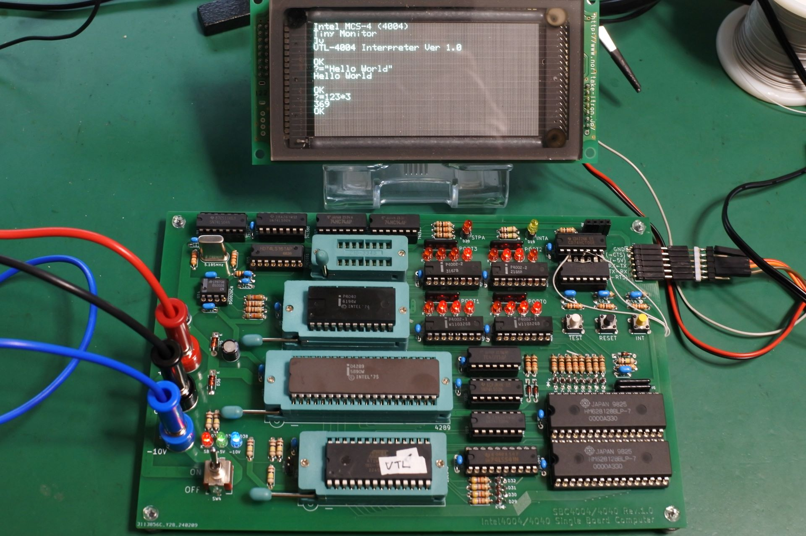

# SBC4040
Single Board Computer using Intel 4040

This document is written mostly in Japanese.
If necessary, please use a translation service such as DeepL (I recommend this) or Google.

## 概要
CPUにIntel 4040を採用したシングルボードコンピュータです．4004実験用ボードをベースにして作りました．4004版と完全上位互換なはず．4040の代わにに4004も載せられるようにしてあります．(絶対に同時には搭載しないこと!)

4040にすることによって追加された機能は下記の通りです．

- ROM領域が4KBから8KBに増加
- サブルーチンコールが3段から7段に増加
- PMR命令により，プログラム領域のRAMを直接読めるようになったはず(未確認)
- 割り込み機能
- ステップ実行は使い道が無さそうなので端子だけ出して未実装

## ToDo
- 割り込み機能の動作確認
- 拡張ROM領域(CMROM1)の動作確認
- PMR命令の動作確認
- モニタプログラム，VTL, 8080エミュレータ等を4040用にリライト

## ソフトウェア開発環境
- [The Macroassembler AS](http://john.ccac.rwth-aachen.de:8000/as/)

## 更新履歴
- 2024/2/22: 初版公開
